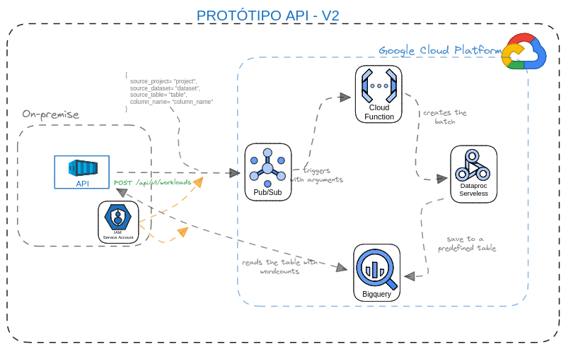

<!-- PROJECT LOGO -->
<br />
<div align="center">

  <h3 align="center">API para Gerenciamento de Workloads no Google Cloud</h3>

  <p align="center">
    Protótipo que simula a criação de contagem de palavras de um dataset do BigQuery
  </p>
</div>

<br>
<p align="justify">
&ensp;&ensp;&ensp;&ensp;Este repositório contém os códigos de um protótipo de API em FastAPI para provisionar um workload em Spark para contagem de palavras de um dataset do BigQuery.
</p>

<br>

⚠️ Caso você esteja olhando este markdown pelo Github, é possível que os links não abram em uma nova aba.

<!-- ABOUT THE PROJECT -->
## Sobre o Projeto

<p align="justify">
&ensp;&ensp;&ensp;&ensp;Visando realizar testes iniciais com gerenciamento de workloads de dados por meio de uma API, optou-se por desenvolver este protótipo. Por enquanto há apenas endpoints que simulam interações com o usuário para a criação de workloads.
</p>

<p align="justify">
&ensp;&ensp;&ensp;&ensp;Para finalidade de testes, está sendo usado o TinyDB como banco de dados backend, permitindo salvar os workloads em disco.
</p>


## Estrutura das Pastas

```
└── workload-api
    ├── app                  ---> diretório principal que contém o código fonte da API
    │   ├── app.py           ---> entrypoint da API
    │   ├── config.py        ---> arquivo para armazenar variáveis de configuração/globais
    │   ├── data             ---> diretório para armazenar inputs
    │   ├── database.py      ---> arquivo de configuração do banco de dados backend
    │   ├── models           ---> diretório para conter os models da API
    │   │   └── workload.py  ---> model do workload. Contém a definição dos métodos HTTP
    │   ├── routers          ---> diretório para conter as rotas da API
    │   │   └── workload.py  ---> arquivo com as rotas de criação, listagem atualização e deleção de workloads
    │   ├── schemas          ---> diretório para conter a estrutura (campos, tipos, restrições) dos objetos do banco
    │   │   └── workload.py  ---> arquivo com po schema do workload
    │   └── utils            ---> diretório para conter arquivos auxiliares, como funções para conexão com o Google Cloud
    │       └── utils.py     ---> arquivo para conter funções auxiliares gerais
    ├── Dockerfile           ---> arquivo para a criação da imagem Docker da API
    ├── DockerfileTest       ---> arquivo para a criação da imagem Docker que executa os testes da API
    ├── pytest.ini           ---> arquivo de configuração do PyTest   
    ├── requirements.txt     ---> arquivos com as dependências Python do projeto
    ├── run.sh               ---> arquivo auxiliar para a execução dos comandos de criação do container
    ├── tests                ---> diretório para conter os arquivos de testes
    │   └── test_app.py      ---> arquivo com testes das rotas da API
    └── volume               ---> volume para mapear a pastas no container - para fins de devesenvolvimento
        └── data             ---> diretório para armazenar inputs
            └── db.json      ---> arquivo do banco de desenvolvimento da API (TinyDB)
```


## Requisitos

Segue abaixo as principais tecnologias e libs utilizadas, juntamente com suas versões.

- <a href="https://www.python.org/" target="_blank">Python 3.11</a>
- <a href="https://fastapi.tiangolo.com/" target="_blank">FastAPI 0.111.1</a>
- <a href="https://docs.pytest.org/en/8.2.x/contents.html" target="_blank">PyTest</a>
- <a href="https://www.docker.com/" target="_blank">Docker</a> (apenas se você for executar com o Docker)


<p align="justify">
&ensp;&ensp;&ensp;&ensp;Para as demais dependências, confira o arquivo de<a href="https://github.com/bastoska/plataforma-dados-api/blob/main/src/workload-api/requirements.txt" target="_blank">requirements</a>.
</p>

## Reprodução

<p align="justify">
&ensp;&ensp;&ensp;&ensp;Para subir a API, há duas opções:
</p>

1. Python via terminal
2. via Docker

<p align="justify">
&ensp;&ensp;&ensp;&ensp;AS duas opção serão detalhadas a seguir. <br>
&ensp;&ensp;&ensp;&ensp; ⚠️ Um ponto importante é que todos os comandos listados abaixo foram executados em terminal de uma distro linux. Caso você utilize outro sistema, é importante ficar atento às possíveis mudanças.
</p>

### Execução com Python via terminal


1. Clone este repositório

    Clone o repositório e entre na pasta:
    ```sh
    git https://github.com/bastoska/plataforma-dados-api.git

    cd plataforma-dados-api/
    ```
2. Configuração do Ambiente
  
    Antes de iniciar, é necessário ter o Python instalado. Caso você não tenha, você pode seguir as instruções deste <a href="https://www.python.org/downloads/" target="_blank">link</a>.

    Uma vez Python esteja instalado na máquina, é necessário criar um ambiente virtual para instalar as dependências de forma isolada:

    ```sh
    python3 -m virtualenv env
    source env/bin/activate
    ```

    Em seguida, entre no diretório de códigos:
    ```sh
    cd src/workload-api
    ```

3. Instale as dependências

    ```sh
    pip install -r requirements.txt
    ```

4. Execute a API

    O Código abaixo expõe a API na porta 8080. Caso ela já esteja sendo usada por alguma outra aplicação, basta alterá-la antes de executar.

    ```sh
    uvicorn app.app:app --host 0.0.0.0 --port 8080
    ```

5. Interação com a API

    Acesse este endereço no navegador:

    ```sh
    http://localhost:8080/
    ```

    O comando acima acessa a rota raiz '/' da API e, se tudo deu certo, mostrará a mensagem `{"message":"Running.."}`.

    O FastAPI gera automaticamente uma documentação da API. Para acessá-la, basta inserir o seguinte endereço no navegador: 

    ```sh
    http://localhost:8080/docs
    ```

6. Execução dos testes

    Foi utilizado o PyTest com httpx para realizar os testes. Para executá-los, basta executar o seguinte comando no terminal:

    ```sh
    pytest
    ```

    Este comando executa os testes presentes em `stc/workload-api/tests/`


7. Cancelando a Execução
   
   Para encerrar a execução da API, basta fechar o terminal ou digitar control+C.


### Execução via Docker

Para subir a API via container é bem mais simples, basta ter o Docker instalado.

1. Instalação Docker

    Você pode seguir as instruções <a href="https://docs.docker.com/engine/install/" target="_blank">deste link</a> para instalar o Docker.


2. Execução da API

    Para facilitar, o script `src/workload-api/run.sh' contém funções para subir o container. Ele contém duas funções: uma para subir a API e outra para executar os testes. O script é simples e, para mais detalhes, basta dar uma olhada nos comentários nele.

    Assim, para subir a API, basta executar:

    ```sh
    bash run.sh up
    ```

    Esse comando construirá a imagem, executará o container e deixará os logs na tela.

    ⚠️ Se, por acaso, você utilize um sistema operacional que não permita a execução do arquivo bash, basta copiar os comandos `docker` e colar no terminal. Lembre de atribuir um nome à imagem e ao container. ⚠️

3. Interação com a API

    Para interagir com a API, basta seguir o mesmo caminho do passo 5 do passo-a-passo anterior com o Python.

4. Execução dos testes

    Já que temos o script bash, basta executar o seguinte comando:

    ```sh
    bash run.sh test
    ```

5. Cancelando a Execução

    Para cancelar a execução, é necessário parar ou remover o container. Execute os seguintes comandos:

    ```sh

    ## se quiser apenas parar
    docker stop workload_api

    ## se quiser excluir
    docker rm -f workload_api
    ```


## Próximos Passos Com o Protótipo

<p align="justify">
&ensp;&ensp;&ensp;&ensp;Como próximo passo para este protótipo, sugerimos uma implementação para executar um batch no Dataproc Serveles conforme a figura abaixo:
</p>

<p align="center">
  
</p>

<p align="justify">
&ensp;&ensp;&ensp;&ensp;Explicação:
</p>

1. Ao receber uma requisição de criação de workload, a API salva o registro banco de dados e envia uma mensagem no PubSub;
2. Uma Cloud Function é acionada com essa mensagem. Essa funtion recebe os parâmetros e criar um batch no Dataproc;
3. O Batch no Dataproc recebe a coluna do `projeto.dataset.table` informado e conta as palavras. Ao finalizar, salva os resultados em uma tabela já previamente criada.
4. A API, por sua vez, lê essa tabela e retorna quando requisitada no respectivo endpoint.


<p align="justify">
&ensp;&ensp;&ensp;&ensp;Para o permissionamento da API ao GCP, usaríamos uma Service Account com as seguintes funções:
</p>


- `roles/pubsub.publisher`: permite o envio de mensagens ao PubSub;
- `roles/bigquery.dataViewer`: permite ler dados e metadados do BigQuery;   
- `roles/bigquery.user`: permite criar queries e executar job no BigQuery.


<p align="justify">
&ensp;&ensp;&ensp;&ensp;Uma vez que a lista de palavras pode ser considerávelmente grande, salvar na tabela do BigQuery como sugerido acima pode ser mais interessante do que retornar essas contas para a API para que ela salve no banco de dados backend. Contudo, é um ponto que precisaríamos avaliar.
</p>


<!-- LICENSE -->
## License

Distributed under the MIT License. See `LICENSE.txt` for more information.
