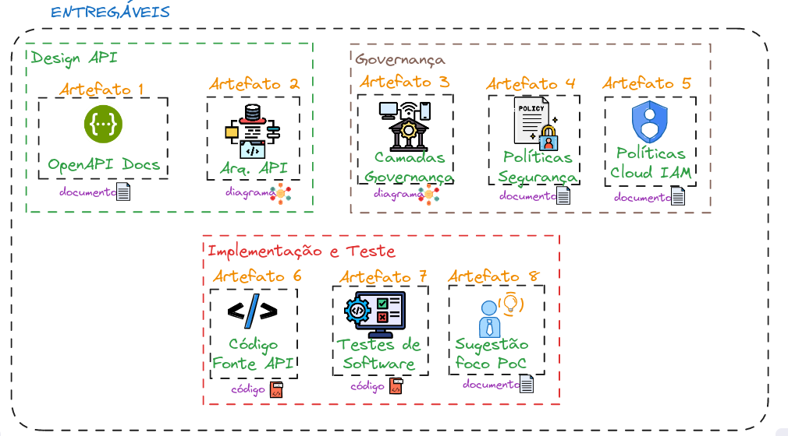

<!-- PROJECT LOGO -->
 

  <h3 align="center">Entregáveis</h3>

  

    Descrição dos Artefatos - documentos e diagramas
  

 

&ensp;&ensp;&ensp;&ensp;Este diretório contém os documentos e diagramas. Para acessá-los, confira a pasta 'arquivos/'.  

Segue abaixo uma descrição sobre cada um deles.

⚠️ Caso você esteja olhando este markdown pelo Github, é possível que os links não abram em uma nova aba.

## Listagem e Descrição

  

### Artefato 1: Documentação da API

&ensp;&ensp;&ensp;&ensp;A Documentação da API foi feita utilizando o padrão OpenAPI, utilizando o <a href="https://editor.swagger.io/" target="_blank"> Editor Swagger</a>. Ele detalha cada um dos endpoints, trazendo o schema do payload eseprado, códigos e mensagens de erros possíveis, bem como exemplos de inputs.

&ensp;&ensp;&ensp;&ensp;Para facilitar, foi criado <a href="https://github.com/bastoska/workload-api-docs" target="_blank">este outro repositório</a> e configurado para hospedar a documentação. Basta clicar <a href="https://bastoska.github.io/workload-api-docs" target="_blank">neste link</a> que você será levado diretamente para o swagger.

&ensp;&ensp;&ensp;&ensp;Aqui no diretório, a documentação está em formato .yaml, no arquivo openapi.yaml

<a href="https://github.com/bastoska/plataforma-dados-api/blob/main/artefatos/arquivos/openapi.yaml" target="_blank">Link para o Arquivo</a>

### Artefato 2: Arquitetura da API

&ensp;&ensp;&ensp;&ensp;O diagrama mostra como o usuário se autentica e se comunica com a API, bem como o acesso da API a recursos do Google Cloud. Além disso, ele traz os respectivos recursos no GCP que serão utilizados no projeto.

<a href="https://github.com/bastoska/plataforma-dados-api/blob/main/artefatos/arquivos/Artefato%202%20-%20Arquitetura%20API.png" target="_blank">Link para o Arquivo</a>

### Artefato 3: Camadas de Arquitetura de Governança

&ensp;&ensp;&ensp;&ensp;O Diagrama apresenta as camadas de Segurança, Acesso e Auditoria e seu relacionamento com a API.

<a href="https://github.com/bastoska/plataforma-dados-api/blob/main/artefatos/arquivos/Artefato%203%20-%20diagramas%20de%20governan%C3%A7a.png" target="_blank">Link para o Arquivo</a>

### Artefato 4: Documentação de Políticas

&ensp;&ensp;&ensp;&ensp;Nesta entrega há três documentos:

- **Artefato 4a**: Políticas de Segurança: lista as políticas de segurança a nível de Proteção de Dados, Segurança de Rede e Controle de Acesso; (<a href="https://github.com/bastoska/plataforma-dados-api/blob/main/artefatos/arquivos/Artefato%204a%20-%20Pol%C3%ADticas%20de%20Seguran%C3%A7a.pdf" target="_blank">Link para o Arquivo</a>)
- **Artefato 4b**: detalha o controle de acesso à API, trazendo os cargos e funções; (<a href="https://github.com/bastoska/plataforma-dados-api/blob/main/artefatos/arquivos/Artefato%204b%20-%20Controle%20de%20Acesso.pdf" target="_blank">Link para o Arquivo</a>)
- **Artefato 4c**: versa sobre as políticas e procedimentos de auditoria. (<a href="https://github.com/bastoska/plataforma-dados-api/blob/main/artefatos/arquivos/Artefato%204c%20-%20Auditoria.pdf" target="_blank">Link para o Arquivo</a>)

&ensp;&ensp;&ensp;&ensp;Para que não seja necessário baixar os .pdfs, segue o link do google docs:

- <a href="https://docs.google.com/document/d/15mES2XgWymjw6FOVtfSIycugyY33weFJ8xXJXMRk31s/edit?usp=sharing">Link 4a</a>
- <a href="https://docs.google.com/document/d/1pltWClSqqoV7u6-Te_5GjA27OXb0yWzBcdvUZn8va-8/edit?usp=sharing">Link 4b</a>
- <a href="https://docs.google.com/document/d/1b8LtxNN54hPeVvVlUt_ds2M-t1mJ636Vce8PLXibvWA/edit?usp=sharing">Link 4c</a>

### Artefato 5: IAM no GCP

&ensp;&ensp;&ensp;&ensp;O Cloud IAM apresenta duversas políticas que suporta a política definida no projeto. O artefato apresenta políticas de RBAC, COntrole de acesso baseado em recursos e permissões com condicionais.

<a href="https://github.com/bastoska/plataforma-dados-api/blob/main/artefatos/arquivos/Artefato%205%20-%20IAM%20GCP.pdf" target="_blank">Link para o Arquivo</a>

<a href="https://docs.google.com/document/d/1aM8nKb_q2F13KbEdcZJyafzhGpPyBGDjbbvyAFKegXc/edit?usp=sharing" target="_blank">Link para o Google Docs</a>

### Artefato 6: Código Fonte do Protótipo

&ensp;&ensp;&ensp;&ensp;O Código fonte se encontra na pasta `/src/workload-api/` aqui neste repositório.

<a href="https://github.com/bastoska/plataforma-dados-api/tree/main/src/workload-api" target="_blank">Link para o Diretório</a>

### Artefato 7: Testes Unitários e de Integração

&ensp;&ensp;&ensp;&ensp;O Código fonte se encontra na pasta `/src/workload-api/tests`. Foram testados testes para os endpoints criação, listagem e deleção.

<a href="https://github.com/bastoska/plataforma-dados-api/tree/main/src/workload-api/tests" target="_blank">Link para o Diretório</a>

### Artefato 8: Sugestão de Foco em PoC

&ensp;&ensp;&ensp;&ensp;Dados os desafios identificados e os objetivos do projeto, a implementação pode ser de fato desafiadora. Visto que a prova de conceito precisa ser bem direcionada, optou-se por dar um foco na parte de Governança e Segurança de Dados. Mais detalhes no artefato.

<a href="" target="_blank">Link para o Diretório</a>

<a href="https://docs.google.com/document/d/1ZRmwbaS-wtdTHflp08-_6Wbg76Sm7z5eYqwbz9CQPlo/edit?usp=sharing" target="_blank">Link para o Google Docs</a>    